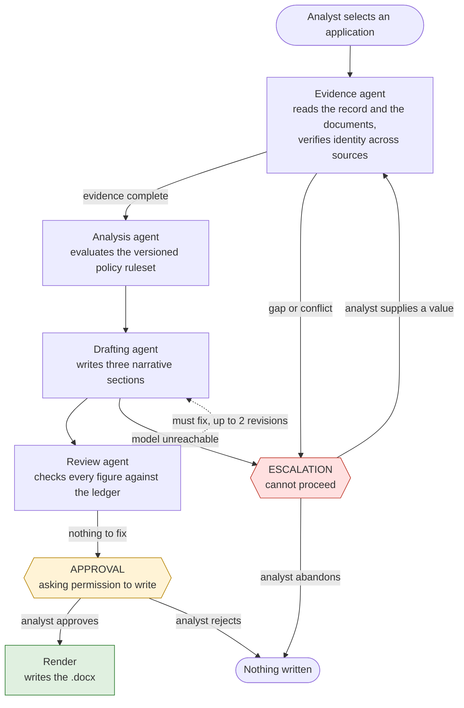

# Credit Memo Agent

A multi-agent system that produces a **first-draft credit memo** consolidating a loan
application file, for a non-bank lender. All data in this repository is synthetic.

This is a verification and consolidation tool for a credit analyst. It cross-checks
identity details across documents, extracts income and credit history, consolidates
everything relevant to one application, and surfaces every discrepancy and gap it finds.

**It is not a credit decisioning engine.** It does not assess, approve, decline, rate or
recommend. Findings use the vocabulary `discrepancy`, `missing`, `note`. The analyst
forms the credit view.

## Setup

```
python -m venv .venv
.venv\Scripts\activate          # Windows
pip install -r requirements.txt
copy .env.example .env          # then fill in the keys
```

The commands below use `python -m` deliberately. On the Microsoft Store build of
Python, console launchers such as `streamlit.exe` are installed into a sandboxed
directory that is not on PATH, so a bare `streamlit run app.py` fails with
"the term 'streamlit' is not recognized". Invoking the module works everywhere.

## Commands

```
python data/generate_db.py        # rebuild the synthetic database
python data/generate_docs.py      # rebuild the synthetic PDFs and defects.json
python -m pytest                  # full test suite
python -m streamlit run app.py    # the UI
```

## How it works

An analyst picks an application. The graph then:

1. selects the memo template from loan purpose and applicant structure
2. pulls the application record from SQLite
3. finds, parses and classifies the supporting documents by content
4. verifies name, date of birth and address in each document against the record
5. extracts credit history and annualises PAYG income from the payslips
6. computes LVR and serviceability with pure functions
7. evaluates the versioned policy ruleset
8. drafts three narrative sections
9. reviews the draft against the ledger
10. stops for approval before writing anything

It halts at one of two interrupts, kept separate in state:

- **`ESCALATION`** - it cannot proceed. Evidence is missing, or two sources
  disagree. The analyst supplies a value, or abandons the run.
- **`APPROVAL`** - it has finished and wants permission to write. The analyst
  approves, edits or rejects.

### The evidence ledger

Every value that may appear in the memo lives in the ledger with a `Provenance`:
a database table and column, a filename and page and document type, or the ledger
fields it was computed from. The Jinja templates can only reach a value through
`f()`, which raises `UnsourcedFigure` if the field is not in the ledger - a
missing key fails the render rather than producing a blank cell, because a blank
cell in a credit memo reads as a fact.

The reviewer closes the loop from the other side: every number-like token in the
narrative must exist in the ledger. That check is a pure function, and it catches
a figure that is arithmetically correct but unsourced - which is exactly what a
model doing its own arithmetic produces.

### Gaps and conflicts

A **gap** is a field with no value found. It is retried within a per-field budget,
and the outcome of each attempt is stored, so a document that parsed cleanly
without the field is never retried while one that failed to parse may be.

A **conflict** is two sources giving different values for the same field. It goes
straight to escalation, consumes no retry budget, and evicts the field from the
ledger - retrying cannot resolve a disagreement, and a disputed value must not sit
in the ledger looking resolved.

## Deviations from the build spec

Both are cases where the spec and `CLAUDE.md` could not both be satisfied.
`CLAUDE.md` won each time.

| Spec says | This repository | Why |
|---|---|---|
| Policy rules carry `severity: hard_fail` | Rules carry `finding_type` of `discrepancy` / `missing` / `note`; results are `within_parameter` / `outside_parameter` / `not_evaluable` | `CLAUDE.md` forbids labelling a finding pass, fail, breach or hard fail |
| The drafting agent writes a `recommendation` section | The third section is `outstanding_items` | `CLAUDE.md` forbids producing a recommendation |

Two other choices worth naming:

- The calculators run inside the evidence loop rather than the analysis agent, so
  the ledger is complete before anything reads it. Analysis evaluates policy and
  computes nothing.
- `computed_lvr` disagreeing with `lvr_stated` is treated as a conflict rather
  than a policy finding. They are two sources for one fact, so the agent does not
  pick between them.

## Running without credentials

The graph runs end to end offline. `LocalTableExtractor` reads the documents'
table structure directly and `OfflineDrafter` assembles narrative from the ledger,
both deterministic. This is what the tests use, so the determinism and defect
cases are exact rather than probabilistic - it is a test double and an offline
fallback, not a second production path. With `NEBIUS_API_KEY` and
`ANTHROPIC_API_KEY` set, extraction goes to Nebius and drafting and review to
Claude. The UI says which mode it is in.

Every model call is logged to `logs/model_calls.jsonl` with prompt, response and
token counts, and API keys are redacted before anything is written.

## Tests

```
pytest                              # 376 tests
pytest tests/test_defects.py        # one end-to-end case per seeded defect
pytest tests/test_determinism.py    # 10 runs, zero figure variance
```

The defect tests read their expectations from `data/defects.json` rather than
hard-coding them, and each asserts the negative as well: that fields unaffected by
the defect still resolved, and that one field's exhausted budget did not consume
another's.

## The synthetic data set

Eight applications, `APP-2026-0001` through `APP-2026-0008`: two owner-occupied single,
two owner-occupied joint, two investment single, two investment joint. Money is stored
as integer cents throughout. Both generators are fully deterministic - regenerating
produces an identical data set.

Each borrower has a bureau-style credit report, an identity verification record, and
three consecutive fortnightly payslips. Documents are text-extractable PDFs with real
table structure, watermarked `SAMPLE - SYNTHETIC DATA`. Filenames are deliberately
unhelpful and decorrelated from document type - the agent classifies from content.

Nothing imitates a real institution. Names, addresses, employers, providers, reference
numbers and identification numbers are all invented.

### Seeded defects

Exactly one thing is broken per application, recorded in `data/defects.json` along with
a manifest of what each unhelpfully named file actually is. Tests read their
expectations from that file rather than hard-coding them.

| Application | Category | Defect |
|---|---|---|
| 0001 | clean | Happy path, single applicant |
| 0002 | clean | Happy path, joint applicants |
| 0003 | missing | No payslips at all for the second applicant |
| 0004 | conflict | KYC names the subject `Katherine`; the record says `Kathryn` |
| 0005 | internally inconsistent | Payslip year-to-date gross figures do not form a sequence |
| 0006 | conflict | `lvr_stated` is 0.78; loan / valuation is 0.85 |
| 0007 | unreadable | One credit report is a corrupt, unparseable PDF |
| 0008 | conflict | Credit report subject DOB disagrees with the borrower record |

## The agents



Only the render node writes anything, and it sits behind the approval interrupt.
Every other node reads.

| Agent | Does | Never does |
|---|---|---|
| **Evidence** | Finds and reads sources, writes values into the ledger with provenance, compares identity details across sources | Estimates or infers a value it could not source |
| **Analysis** | Evaluates the policy ruleset against the ledger, explains why a rule could not be evaluated | Computes a figure, or decides whether a parameter is met |
| **Drafting** | Writes the three narrative sections from a brief containing only ledger values | States a figure that is not in the brief, or forms a credit view |
| **Review** | Verifies every narrative figure exists in the ledger, flags assessment language and omissions | Rewrites the draft, or waves through an unsourced figure |

The evidence agent is the only genuinely agentic node - it loops, choosing which
source to try next for one unresolved field at a time. The model's job in that
loop is narrow enough to test: given a field and the sources available, which
source plausibly contains it. Everything else in the loop is deterministic.

The two interrupts are kept as separate fields in state and never collapsed into
one "waiting for a human" flag, because they mean opposite things. An escalation
says the file is not complete enough to draft from. An approval says the draft is
finished and a person must decide before anything is written.
